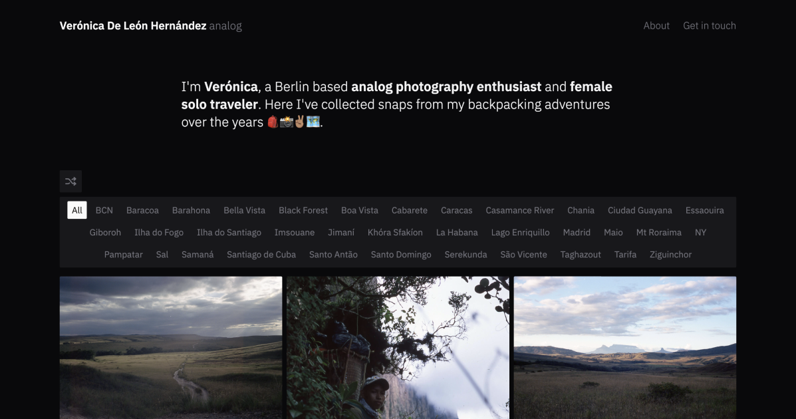

# Analog Photography Portfolio

## About me

I'm Verónica, an analog photography enthusiast and female solo traveler based in Berlin. Since my first solo trip to Cuba in 2018, I’ve been drawn to bringing at least one analog camera with me in all my journeys.

Using analog cameras helps me disconnect from the digital world, creating space for deeper connections with the places I visit and the people I meet.

I plan to continue exploring and visiting more amazing islands and coasts!

## About this web

I designed and built a website to showcase the best analog photographs from my travels. This passion project came to life with modern front-end tools like ReactJS, TailwindCSS, Contentful, and Vercel.

